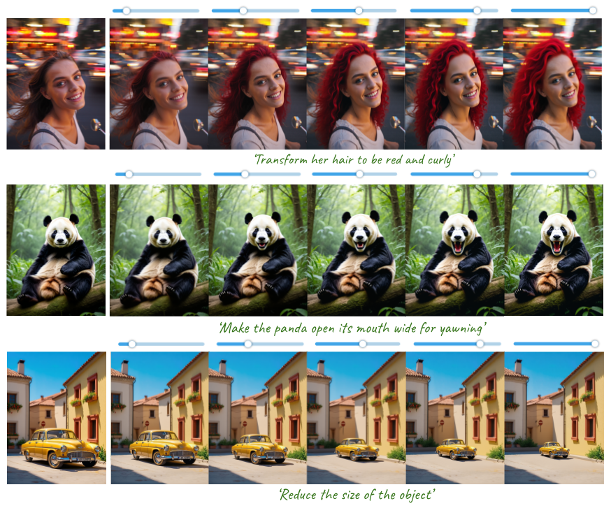
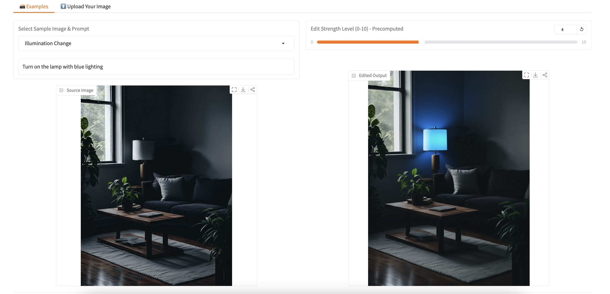

# 🎨 Kontinuous Kontext: Continuous Strength Control for Instruction-Based Image Editing
This repository contains the **official codebase* for **Kontinuous Kontext**, a model for fine-grained **strength control for generalized instruction based image editing**. 

[Rishubh Parihar](https://rishubhparihar.github.io/),  [Or Patashnik](https://orpatashnik.github.io/),   [Daniil Ostashev](https://www.snap.com/en-US/research),   [R. Venkatesh Babu](https://val.cds.iisc.ac.in/),   [Daniel Cohen-Or](https://www.cs.tau.ac.il/~dcor/), [Kuan-Chieh (Jackson) Wang](https://kuanchiehwang.github.io/)  

Snap Research · Tel Aviv University · IISc Bangalore  

## [**arXiv**](https://arxiv.org/abs/2510.08532) · [Project Page](https://snapresearch.github.io/kontinuouskontext/)

---

<p align="center">
  
</p>

---

## 🧩 Abstract
Instruction-based image editing offers a powerful and intuitive way to manipulate images through natural language. Yet, relying solely on text instructions limits fine-grained control over the extent of edits. We introduce Kontinuous Kontext, an instruction-driven editing model that provides a new dimension of control over edit strength, enabling users to adjust edits gradually from no change to a fully realized result in a smooth and continuous manner. Kontinuous Kontext extends a state-of-the-art image editing model to accept an additional input, a scalar edit strength which is then paired with the edit instruction, enabling explicit control over the extent of the edit. To inject this scalar information, we train a lightweight projector network that maps the input scalar and the edit instruction to coefficients in the model's modulation space. For training our model, we synthesize a diverse dataset of image-edit-instruction-strength quadruplets using existing generative models, followed by a filtering stage to ensure quality and consistency. Kontinuous Kontext provides a unified approach for fine-grained control over edit strength for instruction driven editing from subtle to strong across diverse operations such as stylization, attribute, material, background, and shape changes, without requiring attribute-specific training.

---

## 🚀 Getting Started

1.  **Clone the Repository**
    ```bash
    git clone git@github.sc-corp.net:Snapchat/kontinuous_kontext.git
    cd kontinuous-kontext
    ```

2.  **Create the Conda Environment**
    Set up the required environment using the provided file:
    ```bash
    conda env create -f kslider_environment.yml
    ```

---

## 📢 Updates

We have a few extras queued up for release—this section will grow as they roll out.

- [x] Training and inference code release  
- [ ] Release of generated dataset for model training
- [ ] Scripts for dataset generation pipeline


---

## 💡 Inference

Follow these steps to run inference with a pretrained model.

1.  **Download Model Weights**
    Download the model weights from [here](https://huggingface.co/RishubhPar/KontinuousKontextWeights) and copy them into the `./model_weights/` folder.

2.  **Run Inference**
    Execute the `infer.sh` script. This will run the edits on the images from the `./assets/` folder using the prompts defined in the Python script.
    ```bash
    bash infer.sh
    ```

The `infer.sh` script contains the following command.
```bash
python3 test_ksliders.py \
    --pretrained_model_name_or_path=black-forest-labs/FLUX.1-Kontext-dev \
    --trained_models_path=./model_weights \
    --input_images_path=./assets \
    --n_edit_steps=6 \
    --images_save_path=output_images
```

---

## 🎛️ Local Gradio Demo

Spin up the interactive Gradio playground to try your own examples without leaving your machine.

1.  **Install dependencies** (same environment used for inference works here as well).
2.  **Download model weights** into `./model_weights/` if you haven’t already.
3.  **Launch the Gradio UI**:
    ```bash
    python gradio_demo.py \
        --pretrained_model_name_or_path=black-forest-labs/FLUX.1-Kontext-dev \
        --trained_models_path=./model_weights \
        --input_images_path=/path/to/your/images
    ```
4.  Open the printed local URL (defaults to `http://127.0.0.1:7860`) and upload an image plus an edit instruction. Adjust the strength slider to explore the continuum of edits.

<p align="center">
  
</p>

<sub>Screenshot placeholder — drop in your latest Gradio UI preview when ready.</sub>

> Tip: Use `--share` when launching if you want to generate a temporary public Gradio link for collaborators.

---

# 🏋️ Kontinuous Kontext: Model Training

We build our model on Flux Kontext[https://huggingface.co/black-forest-labs/FLUX.1-Kontext-dev], an instruction-based image editing model. For training you have to download the Flux Kontext model and the training dataset as discussed below.

---

<!--
## 1. Dataset

* You can download the full dataset required for training from our **[Hugging Face Hub (TODO: Add URL)]**.
* The dataset is organized into two parts:
    * `morphing_data`: Contains the image edit sequences generated by our data generation pipeline.
    * `metadata.json`: Contains all metadata for the slider dataset, including image names, edit instructions, and LPIPS scores for each sequence.
* The dataset will be filtered in the slider_dataset.py by loading the metadata.json file. You can also adjust the filtering criteria based on your requirement.
-->

## 2. Hardware Requirements

We trained our model on 8 x NVIDIA A100 (80G) GPU for 110,000 iterations. The training typically requires 3-4 days on this hardware.

## 3. Run Training

You can start a training run by executing the `train.sh` script. The base `FLUX.1-Kontext-dev` model will be downloaded automatically by the script on the first run.

```bash
bash train.sh
```

Your training logs will be saved inside the ./logs/ folder.

Here is the full content of the training script, which includes all hyperparameters used for our model:

```bash
RUN_NAME="TRAINING_RUN"

accelerate launch train_model.py \
  --pretrained_model_name_or_path=black-forest-labs/FLUX.1-Kontext-dev \
  --output_dir=runs/$RUN_NAME \
  --mixed_precision="bf16" \
  --resolution=512 \
  --kl_threshold=0.15 \
  --filter="kl-filter-simple" \
  --train_batch_size=1 \
  --guidance_scale=1 \
  --optimizer="adamw" \
  --use_8bit_adam \
  --learning_rate=2e-5 \
  --lr_scheduler="constant" \
  --lr_warmup_steps=200 \
  --max_train_steps=110000 \
  --checkpointing_steps=2000 \
  --report_to="wandb" \
  --run_name=$RUN_NAME \
  --drop_text_prob=0.0 \
  --validation_image_path="./src_imgs" \
  --num_validation_images=1 \
  --slider_projector_out_dim=6144 \
  --slider_projector_n_layers=4 \
  --modulation_condn=True \
  --is_clip_input=True \
  --seed="0" 2>&1 | tee logs/${RUN_NAME}.log
```

```
@article{parihar2025kontinuouskontext,
  title     = {Kontinuous Kontext: Continuous Strength Control for Instruction-based Image Editing},
  author    = {Parihar, Rishubh and Patashnik, Or and Ostashev, Daniil and Babu, R. Venkatesh and Cohen-Or, Daniel and Wang, Kuan-Chieh Jackson},
  journal   = {arXiv preprint arXiv:2510.08532},
  year      = {2025},
  url       = {https://arxiv.org/abs/2510.08532}
}
```
  
